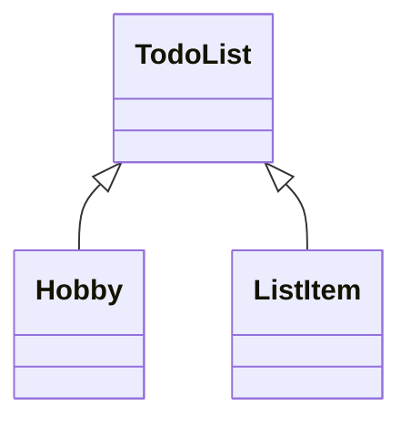

# TodoList项目开发文档
[English Version](README_en.md)
### 项目介绍

一个待办系统，分为两个部分

1. 待办功能
2. 习惯功能

本项目2024年12月停止更新，更换了新的项目地址。[新项目地址Schedule](https://github.com/doctordragon666/Schedule)

停更原因：
1. 代码很混乱：qrc和代码设置样式表混在一起，类太多了。
2. 开发经验不足：走了很多弯路
3. 程序的美术风格不统一

该项目的技术栈是QT+Visual Studio 2022。开发体验不好，而且属于小型项目。
### 软件架构

因为该项目已经弃用，尽可能的简化这个架构的设计，用来做参考。

文件的详细信息在各个头文件中有说明，这里只简单列举一下项目文件

```shell
.
│   .gitignore
│   Hobby.cpp
│   Hobby.h
│   Hobby.ui
│   LICENSE
│   ListItem.cpp
│   ListItem.h
│   ListItem.ui
│   main.cpp # 主程序入口
│   TodoList.cpp
│   TodoList.h
│   TodoList.ui 
│   TodoList.ico
│   TodoList.pro
│   TodoList.pro.user
│   TodoList.qrc
│   add_item.png
└───example # 存放示例文件和程序运行图片
        data.txt
        hobby.txt
        record.txt
```
关键的类图显示


该项目中按钮样式所用的qss样式表
```css
QPushButton
{
    color:#ffffff; /*文字颜色*/
    background-color:qlineargradient(x1: 0, y1: 0, x2: 0, y2: 1, stop:0 #aa55ff, stop: 1 #1296db);/*背景色*/
    border-style:outset; /*边框风格*/
    border-width:2px;/*边框宽度*/
    border-color:#0055ff; /*边框颜色*/
    border-radius:10px; /*边框倒角*/
    font:bold 14px; /*字体*/
    font-family: Segoe UI;
    min-width:100px;/*控件最小宽度*/
    min-height:20px;/*控件最小高度*/
    padding:4px;/*内边距*/
}
 
QPushButton:hover
{
    color:#ffffff; /*文字颜色*/
    background-color:qlineargradient(x1: 0, y1: 0, x2: 0, y2: 1, stop:0 #ff55ff, stop: 1 #1296db);/*背景色*/
    border-style:outset; /*边框风格*/
    border-width:2px;/*边框宽度*/
    border-color:#0055ff; /*边框颜色*/
    border-radius:10px; /*边框倒角*/
    font:bold 14px; /*字体*/
    font-family: Segoe UI;
    min-width:100px;/*控件最小宽度*/
    min-height:20px;/*控件最小高度*/
    padding:4px;/*内边距*/
}
QPushButton:pressed
{
    color:#ffffff; /*文字颜色*/
    background-color:qlineargradient(x1: 0, y1: 0, x2: 0, y2: 1, stop:0 #ff55ff, stop: 1 #aa00ff);/*背景色*/
    border-style:outset; /*边框风格*/
    border-width:2px;/*边框宽度*/
    border-color:#0055ff; /*边框颜色*/
    border-radius:10px; /*边框倒角*/
    font:bold 14px; /*字体*/
    font-family: Segoe UI;
    min-width:100px;/*控件最小宽度*/
    min-height:20px;/*控件最小高度*/
    padding:4px;/*内边距*/
}
```

### 使用说明

首先我们简单的看一下软件的界面

这是习惯的UI设计图


这是代办的UI设计图


这是主界面的UI设计图


这是程序实际运行的效果图


每次使用前可能提示你需要重启程序，重启以后就可以使用了，文件下面有保存文件的按钮，点击修改可以更换代办的内容。

下面有一个简单的运行实际效果


### 许可证

基于MIT许可证
